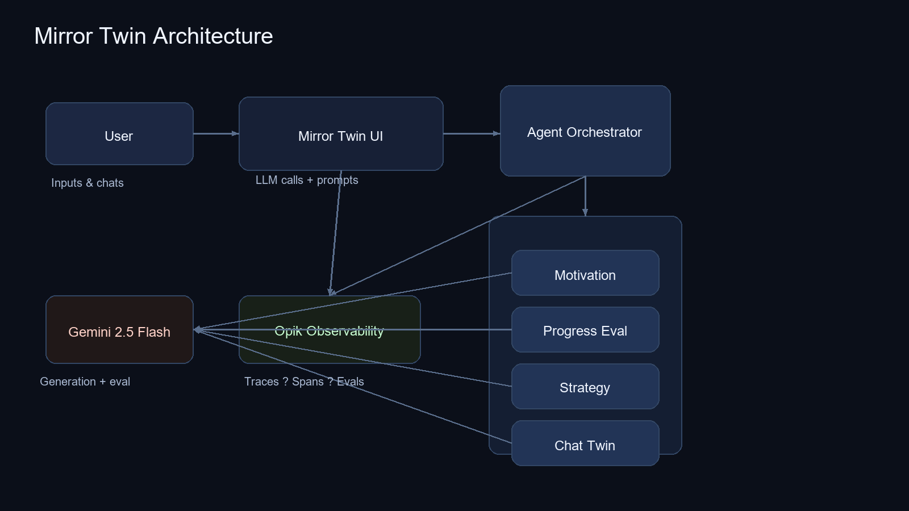

# Mirror Twin

Mirror Twin is a daily accountability companion that speaks as your future self.  
You log quick entries, and the app responds with grounded motivation tailored to your goal.  
It tracks real effort over perfection, so progress feels fair and sustainable.  
Stage-based strategies keep the next step clear and small.  
The result is a light, repeatable loop that builds momentum without guilt.  
Designed for privacy and safety, it keeps outputs helpful and concise.  

## Links
1. Live demo: `ADD_LIVE_DEMO_URL`
2. Video walkthrough: `ADD_VIDEO_URL`

## Tech Stack
- React + TypeScript + Vite
- Tailwind CSS
- Google Gemini (generation + evaluation)
- Opik (tracing + evals)

## Architecture Diagram

## Opik Observability
Mirror Twin logs each agent run as a trace with spans for LLM calls.  
LLM-as-judge scoring tracks relevance and usefulness across:
- Motivation output
- Chat twin replies
- Progress evaluations  
This makes it easy to detect drift, compare prompt versions, and improve quality.

## Getting Started
1. Install dependencies:
   - `bun install`
2. Create a `.env`:
   - `cp .env.example .env`
3. Set environment variables:
   - `VITE_GEMINI_API_KEY`
   - `VITE_CLERK_PUBLISHABLE_KEY` (optional)
   - `VITE_OPIK_API_KEY`
   - `VITE_OPIK_PROJECT_NAME`
4. Run the app:
   - `bun run dev`

## Verified Scenarios
- Setup flow: name + resolution + struggles -> main dashboard
- Daily log: entry saved, streak increments
- Progress evaluation: returns `progressDelta` and reason
- Mirror Twin chat: responds to the latest user message
- Motivation agent: generates a short, grounded summary
- Opik telemetry: traces and evals appear in the Opik UI
